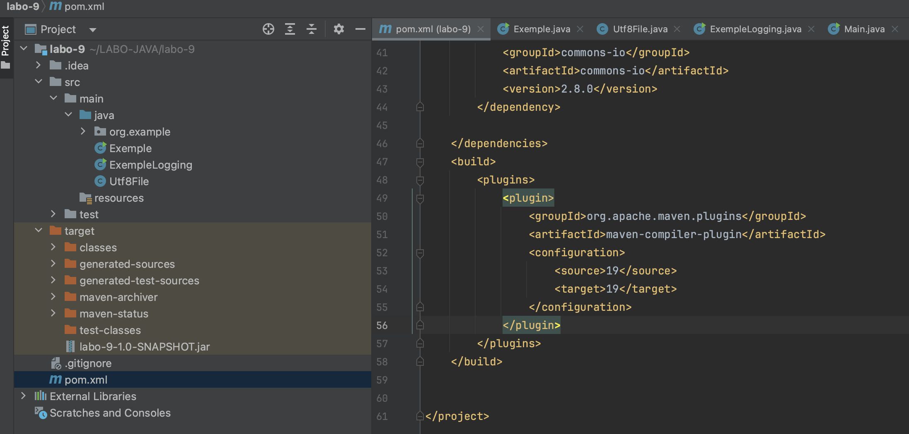

## Maven, guide d'utilisation rapide

### Pour créer un projet Maven dans IntelliJ*
Si aucun projet n'est actuellement ouvert dans IntelliJ IDEA, cliquez sur "Nouveau Projet" sur l'écran d'accueil. 
Sinon, sélectionnez "Fichier | Nouveau | Projet" dans le menu principal.

1- Donnez un nom au nouveau projet et modifiez son emplacement si nécessaire.

2- Sélectionnez "Créer un dépôt Git" pour placer le nouveau projet sous contrôle de version. Vous pourrez 
le faire ultérieurement à tout moment.

3- Sélectionnez le langage que vous souhaitez utiliser dans votre projet, dans votre cas c'est `Java`. 
Cliquez sur "Ajouter une application générale" si vous souhaitez ajouter d'autres langages disponibles 
via des plugins.

4- Sélectionnez "Maven" dans la liste des systèmes de construction.

5- Spécifiez le JDK (Kit de développement Java) du projet ou utilisez celui par défaut.

(L'option "Ajouter un code d'exemple" sélectionnée créera un fichier avec un exemple de code de base.)

6- Dans les paramètres avancés, spécifiez les coordonnées Maven suivantes qui seront ajoutées au fichier `pom.xml` :

- GroupId : le groupe du nouveau projet.
- ArtifactId : le nom de votre projet.
- Pour plus d'informations sur les coordonnées Maven, consultez les conventions de nommage Maven.

7- Cliquez sur "Créer".

IntelliJ IDEA crée un projet Maven avec le fichier pom.xml qui inclut les versions du compilateur 
et de la cible Java, la fenêtre dédiée à Maven, ainsi que toutes les dépendances nécessaires pour 
commencer votre travail.

####
Ajoutez vos dépendences afin d'obtenir un fichier `pom` tel que nous avons en labo:

```agsl
<dependencies>
        <dependency>
            <groupId>net.sf.json-lib</groupId>
            <artifactId>json-lib</artifactId>
            <version>2.4</version>
            <classifier>jdk15</classifier>
        </dependency>

        <dependency>
            <groupId>com.googlecode.json-simple</groupId>
            <artifactId>json-simple</artifactId>
            <version>1.1.1</version>
        </dependency>

        <!-- https://mvnrepository.com/artifact/commons-logging/commons-logging -->
        <dependency>
            <groupId>commons-logging</groupId>
            <artifactId>commons-logging</artifactId>
            <version>1.2</version>
        </dependency>

        <!-- https://mvnrepository.com/artifact/commons-io/commons-io -->
        <dependency>
            <groupId>commons-io</groupId>
            <artifactId>commons-io</artifactId>
            <version>2.8.0</version>
        </dependency>
    </dependencies>
```
Il possible de trouver les librairies sur le site de Maven: [https://mvnrepository.com/](https://mvnrepository.com/)

### Compilation avec Maven: de Maven à un JAR

Toout d'abord il est nécéssaire d'installer Maven sur vos machine.

Pour installer Maven sur vos machines:
- Téléchargez Maven : Rendez-vous sur le site officiel d'Apache Maven (https://maven.apache.org/download.cgi) 
et téléchargez la dernière version de Maven pour votre système d'exploitation. Assurez-vous de télécharger le 
fichier binaire (binaries).

- Installez Maven : Une fois le téléchargement terminé, suivez les instructions d'installation spécifiques à votre 
système d'exploitation. En général, cela consiste à extraire l'archive téléchargée vers un répertoire de votre 
choix sur votre système.

- Configurez la variable d'environnement PATH : Pour que vous puissiez exécuter la commande mvn depuis n'importe 
quel emplacement de votre système, vous devez ajouter le répertoire bin de l'installation de Maven à votre 
variable d'environnement PATH. La manière de le faire varie selon votre système d'exploitation :

Sur Windows : Ajoutez le chemin du répertoire bin de l'installation de Maven à la variable PATH. 
Vous pouvez le faire en recherchant "Variables d'environnement" dans les paramètres système.

Sur Linux/macOS : Modifiez votre fichier ~/.bashrc, ~/.bash_profile, ou ~/.zshrc en ajoutant la ligne suivante :
```agsl
export PATH=/chemin/vers/votre/repertoire/maven/bin:$PATH
```

Assurez-vous de remplacer /chemin/vers/votre/repertoire/maven par le chemin réel de votre installation Maven.

Vérifiez l'installation : Ouvrez un nouveau terminal ou invite de commandes et exécutez la commande 
`mvn clean package` ou `mvn version`. Si vous obtenez un résultat, même si c'est du charabiat, vous êtes good to go!
Vous devriez maintenant être en mesure de lancer Maven. Si cela ne marche pas, essayer ceci:
- Allez à la racine de votre projet de session.
- Refaite l'étape qui consiste à changer la variable d'environnement PATH
- Si cela ne marche toujours pas, prenez un marteau et défoncez votre ordinateur jusqu'à ce que ca marche.

Vous pouvez alors utiliser les commandes suivantes:

- `mvn compile` compile le projet
- `mvn test` compile et teste le projet
- `mvn package` compile, teste et transforme le projet en un fichier `.jar` dans 
- le dossier `target`.
- `mvn clean` supprime le contenu du dossier target.

Note: Vous pouvez combiner ces commandes, par exemple avec `mvn clean package`.

#### Quoi ajouter au fichier pom

Afin d'automatiser le processus votre fichier `pom.xml` doit contenir ceci:

```agsl
    <build>
        <plugins>
            <plugin>
                <groupId>org.apache.maven.plugins</groupId>
                <artifactId>maven-compiler-plugin</artifactId>
                <configuration>
                    <source>17</source>
                    <target>17</target>
                </configuration>
            </plugin>
        </plugins>
    </build>
```

#### Le dossier target
Lorsque vous aurez fait la commande `mvn package` 
vous remarquerez l'ajout un dossier nommé `Target` qui contiendra votre Jar.  
  



Les plus allumé d'entre-vous auront surement remarqué que le nom du jar est donné depuis les premières
lignes contenu dans le fichier `pom`;

```agsl
    <artifactId>labo-9</artifactId>
    <version>1.0-SNAPSHOT</version>
```


Pour en apprendre plus, référez-vous au [guide Maven](https://maven.apache.org/guides/getting-started/index.html).


*[Traduis en français depuis le site officiel de Jetbrains](https://www.jetbrains.com/help/idea/maven-support.html)